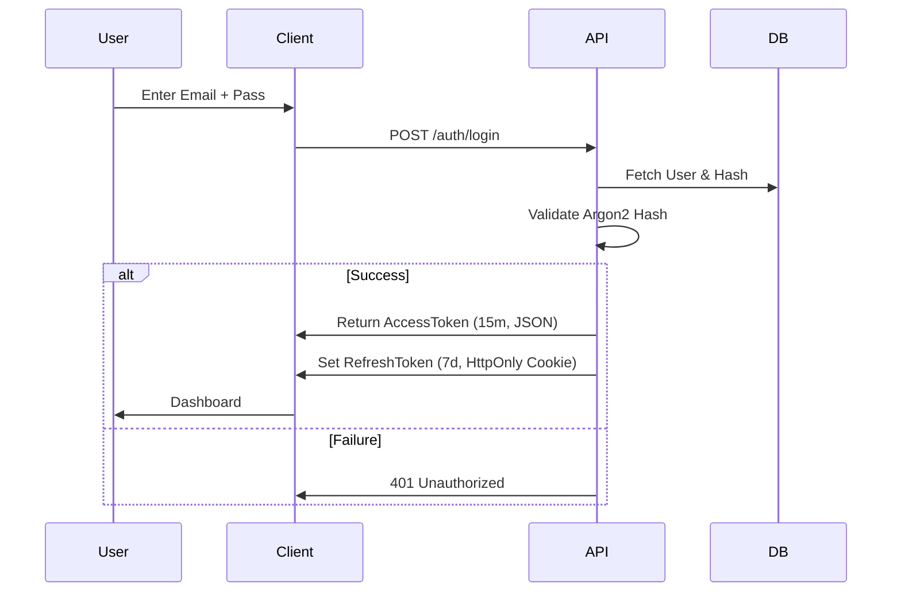

# Authentication & Security Flow

## Login Flow (Secure)


## Privacy & Profile View Level
```mermaid
graph TD
    A[Viewer] -->|Request Profile| B{Relation Status?}
    B -->|None| C[Public View (Redacted)]
    B -->|Interest Sent| C
    B -->|Accepted| D[Private View (Full Contact Info)]
    B -->|Blocked| E[Access Denied]
```
